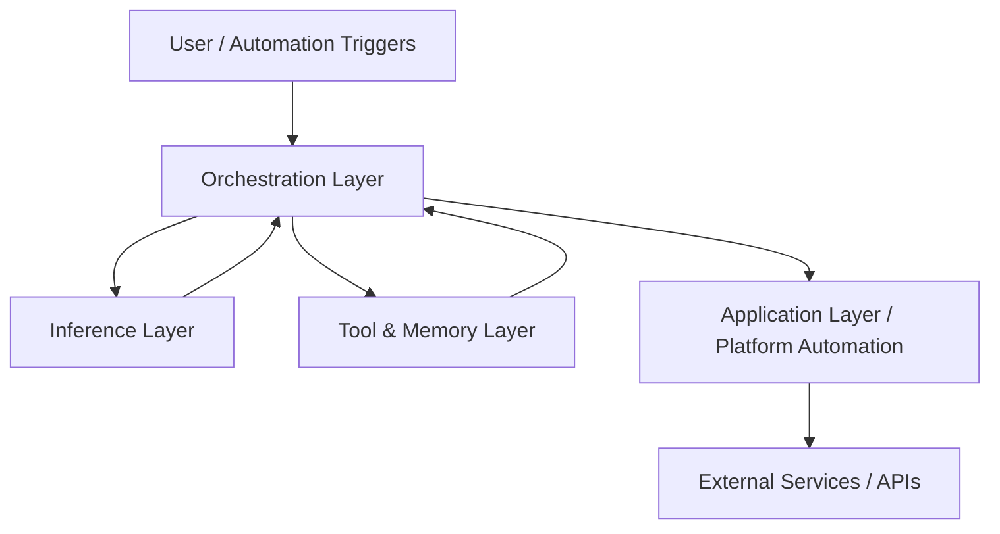
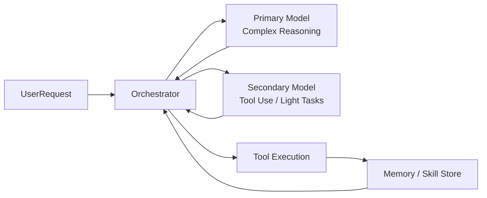
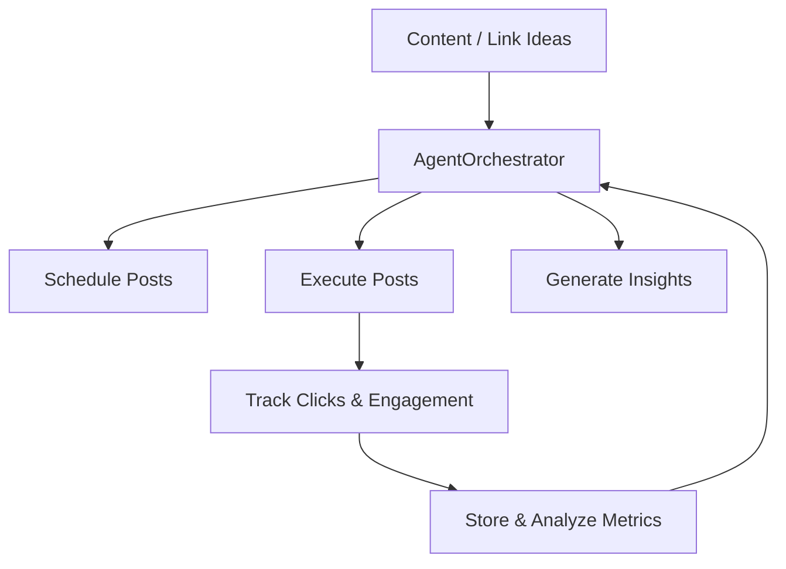

# Architecture

This document describes the high-level architecture of the local AI and autonomous agent system.

## Overview

The system is designed as a fully local, self-hosted stack that combines optimized LLM inference with autonomous agent orchestration. It enables reliable, multi-step automation without relying on cloud APIs.

The core philosophy is:
- Run capable models locally with good performance and stability
- Use multiple specialized models together rather than one monolithic model
- Build reliable agent workflows through clear orchestration and tooling
- Apply this to real automation tasks (content distribution, tracking, and analytics)

## High-Level Layers

The architecture is organized into four main layers:

1. **Inference Layer** — Optimized local model serving
2. **Orchestration Layer** — Agent coordination and task routing
3. **Tool & Memory Layer** — Extensible capabilities and persistence
4. **Application Layer** — Domain-specific automation (social link platform)

## 1. Inference Layer

This layer handles running large language models locally with good efficiency.

**Key components:**
- **llama.cpp** as the inference engine
- **TurboQuant** for KV cache compression and expert offloading (especially useful for MoE models like Qwen series)
- **Dual-model deployment** pattern: one primary high-capability model + one secondary model optimized for lighter tasks and tool use
- Models run as always-on servers on different ports for isolation and resource management

**Design goals:**
- Maximize VRAM efficiency
- Maintain stable long-running inference
- Allow different models to specialize (reasoning vs. tool calling / lighter tasks)

See `docs/dual-llm-deployment.md` and `docs/model-optimization.md` for implementation details.

## 2. Orchestration Layer

This is the "brain" that coordinates work across models and tools.

**Key technologies:**
- Hermes Agent framework (self-improving agents, skill creation, memory)
- OpenClaw (agent runtime and tool integration)
- Custom orchestration logic and coordination patterns

**Responsibilities:**
- Task decomposition and routing between models
- Managing conversation history and memory
- Deciding when to call tools vs. use LLM reasoning
- Handling self-improvement loops (creating and refining skills from experience)
- Error handling, retries, and fallback strategies

The orchestration layer acts as the central coordinator so individual models don't need to know about the full system.

## 3. Tool & Memory Layer

Agents become useful when they can take real actions and remember context.

**Tool system:**
- Custom tools for scheduling, data retrieval, posting, analytics collection, etc.
- Tools are registered with the agent framework and can be called dynamically
- Clear input/output schemas for reliability

**Memory & persistence:**
- Short-term conversation memory
- Longer-term skill and experience storage (Hermes-style self-improvement)
- Ability to recall past actions and outcomes to improve future behavior

This layer turns raw model intelligence into repeatable, useful automation.

## 4. Application Layer (Business Automation Platform)

This layer applies the agent system to a real product use case: an AI-driven platform for social media link posting, click tracking, and engagement analytics.

**High-level responsibilities:**
- Content scheduling and distribution across platforms
- Automated link posting with tracking parameters
- Collection of engagement metrics (clicks, views, interactions)
- Feeding performance data back into future decisions
- Iterative improvement of posting strategy based on results

The agent system here acts as a reliable "mini team" that can handle repetitive and analytical work with minimal human intervention.

## Key Design Decisions

- **Dual-model approach** over single large model: Better resource utilization and specialization
- **Local-first**: All inference and orchestration happens on-prem for privacy, cost control, and reliability
- **Tool-centric agents**: Emphasis on giving agents clear, reliable tools rather than hoping the LLM does everything
- **Self-improvement focus**: Using Hermes-style loops so agents get better at recurring tasks over time
- **Separation of concerns**: Inference, orchestration, tools, and application logic are loosely coupled

## Current Limitations

- Single-machine deployment (not distributed)
- Model capability is bounded by available VRAM and chosen models
- Agent reliability depends heavily on well-designed tools and memory
- Some advanced self-improvement features are still maturing in the underlying frameworks

## Future Improvements

- Stronger long-term memory and skill persistence
- More robust monitoring, logging, and self-correction
- Expanded library of reliable, reusable tools
- Tighter integration between the orchestration layer and the business automation platform
- Better evaluation and benchmarking of agent workflows

See the `docs/` folder for deeper dives into specific components.
