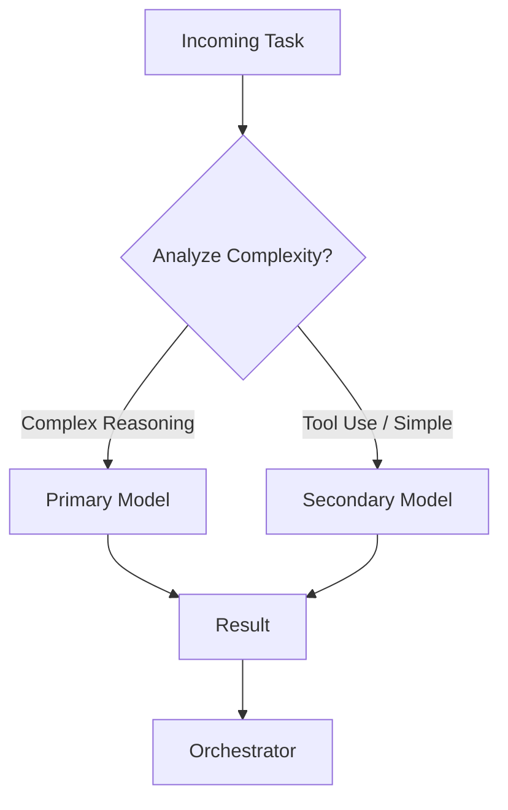

# Simple Task Routing Example

This document shows a basic pattern for routing tasks between the primary and secondary models.

## Routing Logic (High-Level)

## Guidelines

- Use the **Primary Model** for:
  - Architecture and design decisions
  - Complex debugging or multi-step reasoning
  - Tasks requiring high accuracy

- Use the **Secondary Model** for:
  - Tool calling and parameter generation
  - Simple status checks or decisions
  - Intermediate steps in a workflow

- The Orchestrator is responsible for:
  - Deciding which model to use
  - Combining results from both models
  - Handling errors and fallbacks

This pattern helps balance quality and speed while keeping token usage efficient.
